# RenameSkills-Unity

RenameSkills-Unity is a Unity Editor + Cursor MCP tool for batch-renaming GameObjects in the currently active Unity scene. It lets an AI agent in Cursor inspect scene objects, preview rename plans, and execute template or regex-based renames through a local Unity Editor bridge.

## What It Does

- Lists matching GameObjects from the active Unity scene.
- Renames scene objects with indexed templates such as `Enemy_{index:00}`.
- Renames scene objects with regex replacement, such as `Cube(12)` -> `Cube12`.
- Runs all Unity scene reads and writes on the Unity main thread.
- Uses Unity Undo for rename operations.
- Excludes Unity generated folders such as `Library/`, `Temp/`, and `Logs/` from Git.

## Architecture

```mermaid
flowchart LR
    User["User prompt in Cursor"] --> Cursor["Cursor AI Agent"]
    Cursor --> MCP["MCP stdio server\nTools/unity-mcp-scene-rename/server.mjs"]
    MCP --> Tools["Rename tool registry\nunityRenameTools.mjs"]
    Tools --> HTTP["HTTP JSON request\nhttp://127.0.0.1:8756"]
    HTTP --> UnityServer["UnityMcpSceneRenameServer\nAssets/Editor"]
    UnityServer --> MainThread["EditorApplication.update\nUnity main thread dispatch"]
    MainThread --> Scene["Active Unity Scene\nGameObjects"]
    Scene --> Undo["Undo.RecordObject\nEditorSceneManager.MarkSceneDirty"]
```



## File And Class Responsibilities

### `.cursor/mcp.json`

Cursor MCP configuration. It tells Cursor to start the local Node MCP server with:

```json
{
  "command": "node",
  "args": [
    "D:\\unity class program\\MyUnityMCP\\Tools\\unity-mcp-scene-rename\\server.mjs"
  ]
}
```

### `Tools/unity-mcp-scene-rename/server.mjs`

Thin MCP process entrypoint.

- Creates the `McpServer`.
- Reads `UNITY_MCP_URL`, defaulting to `http://127.0.0.1:8756`.
- Registers rename tools through `registerUnityRenameTools(...)`.
- Connects Cursor to the server with `StdioServerTransport`.

### `Tools/unity-mcp-scene-rename/unityRenameTools.mjs`

MCP tool definitions and Unity HTTP client.

It registers these tools:

- `unity_list_scene_objects`
- `unity_preview_batch_rename`
- `unity_batch_rename_scene_objects`
- `unity_preview_regex_rename`
- `unity_regex_rename_scene_objects`

It also owns:

- Tool parameter schemas using `zod`.
- JSON POST requests to Unity endpoints.
- Error formatting for Cursor.

### `Tools/unity-mcp-scene-rename/package.json`

Node package definition for the MCP bridge.

Main dependencies:

- `@modelcontextprotocol/sdk`
- `zod`

### `Assets/Editor/UnityMcpSceneRenameServer.cs`

Unity Editor-side local HTTP server and rename engine.

Important pieces:

- `UnityMcpSceneRenameServer`: static Editor server initialized by `[InitializeOnLoad]`.
- `StartServer`, `StopServer`, `ShowStatus`: Unity menu/server lifecycle helpers.
- `HandleContextAsync`: routes HTTP endpoints to Unity operations.
- `RunOnMainThread`: dispatches work back to Unity's main thread through `EditorApplication.update`.
- `ListSceneObjects`: returns matching scene object metadata.
- `BuildRenamePlan`: builds template-based rename plans.
- `BatchRenameSceneObjects`: executes template-based renames.
- `BuildRegexRenamePlan`: builds regex replacement rename plans.
- `RegexRenameSceneObjects`: executes regex replacement renames.
- `RenameRequest`: parses and validates JSON request fields.
- `MiniJson`: small embedded JSON parser/serializer used to avoid adding C# package dependencies.

### `Assets/Scenes/SampleScene.unity`

Default Unity sample scene used by the project. The rename tool works on whichever scene is currently active in the Unity Editor.

### `.gitignore`

Keeps generated or machine-local files out of Git, including:

- `Library/`
- `Temp/`
- `Logs/`
- `UserSettings/`
- generated `.csproj` / `.sln`
- `Tools/unity-mcp-scene-rename/node_modules/`

## MCP Tools

### `unity_list_scene_objects`

Lists matching GameObjects in the active scene.

Common filters:

- `nameContains`
- `nameRegex`
- `pathContains`
- `pathRegex`
- `tag`
- `componentType`
- `includeInactive`
- `allowAll`

Safety rule: if no filters are provided, set `allowAll: true`.

### `unity_preview_batch_rename`

Previews template-based renames without changing the scene.

Template examples:

- `Enemy_{index}`
- `Enemy_{index:00}`
- `{name}_LOD{index}`

### `unity_batch_rename_scene_objects`

Executes template-based renames immediately. Unity Undo can revert the operation.

### `unity_preview_regex_rename`

Previews regex replacement renames without changing the scene.

Example:

```json
{
  "nameRegex": "^Cube\\(\\d+\\)$",
  "searchRegex": "^Cube\\((\\d+)\\)$",
  "replacement": "Cube$1"
}
```

### `unity_regex_rename_scene_objects`

Executes regex replacement renames immediately. Unity Undo can revert the operation.

## Example Cursor Prompts

Remove parentheses from `Cube(1)`, `Cube(2)`, and similar names:

```text
Use the Unity MCP rename tool to rename every active-scene object named like Cube(number) by removing the parentheses. Execute directly.

Parameters:
nameRegex: "^Cube\\(\\d+\\)$"
searchRegex: "^Cube\\((\\d+)\\)$"
replacement: "Cube$1"
```

Rename all enemies with indexed names:

```text
Use the Unity MCP rename tool to rename all scene objects whose names start with Enemy into Enemy_{index:00}, sorted by hierarchy. Execute directly.
```

Preview before execution:

```text
Use unity_preview_regex_rename first to preview all objects shaped like Name(number), replacing them with Namenumber. If the preview looks correct, call unity_regex_rename_scene_objects.
```

## Setup

1. Open this Unity project in Unity 2021.3.44f1c1 or a compatible Unity 2021.3 version.
2. Wait for scripts to compile.
3. In Unity, check:

```text
Tools > Unity MCP > Scene Rename Server > Status
```

4. In the MCP bridge folder, install Node dependencies if needed:

```powershell
cd "Tools\unity-mcp-scene-rename"
npm install
```

5. Restart Cursor or refresh MCP servers so it reads `.cursor/mcp.json`.

## Notes

- The Unity server listens on `http://127.0.0.1:8756`.
- Only the currently active scene is modified.
- Prefab assets are not renamed by this tool.
- Rename execution no longer requires a `confirm` field.
- Use Unity Undo to revert the last rename operation.
