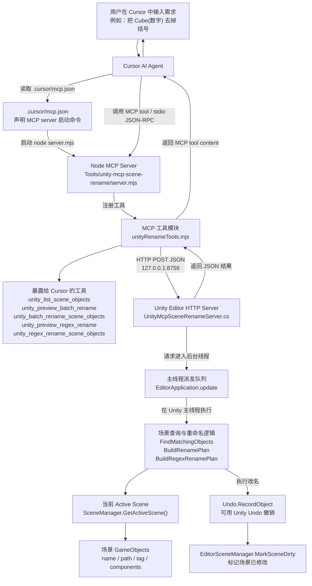

# RenameSkills-Unity

## 中文项目介绍

RenameSkills-Unity 是一个批量重命名工具。它通过 MCP（Model Context Protocol）把 Cursor 里的 AI Agent 和 Unity 编辑器连接起来，让 AI 可以直接读取当前 Unity 场景里的 GameObject，并按规则批量重命名。

这个工具适合处理这些场景：

- 把 `Cube(1)`、`Cube(2)`、`Cube(12)` 批量改成 `Cube1`、`Cube2`、`Cube12`。
- 把一批对象按层级顺序重命名为 `Enemy_01`、`Enemy_02`、`Enemy_03`。
- 删除对象名里的 `(Clone)`、多余空格、括号或其他固定文本。
- 让 Cursor 里的 AI 根据筛选条件自动查找场景物体，而不是手动把所有对象名输入到聊天框。

工具的核心思路是：Cursor 不直接操作 Unity 场景，而是启动一个本地 Node MCP 服务；这个 MCP 服务再通过本机 HTTP 请求调用 Unity Editor 内部的 C# 服务；Unity 服务最终在主线程里执行查询、预览和重命名。

## 工具架构图



## 文件与类作用说明

### `.cursor/mcp.json`

Cursor 的 MCP 配置文件。Cursor 会读取它，并启动本项目里的 Node MCP 服务：

```json
{
  "mcpServers": {
    "unity-scene-rename": {
      "type": "stdio",
      "command": "node",
      "args": [
        "D:\\unity class program\\MyUnityMCP\\Tools\\unity-mcp-scene-rename\\server.mjs"
      ],
      "env": {
        "UNITY_MCP_URL": "http://127.0.0.1:8756"
      }
    }
  }
}
```

### `Tools/unity-mcp-scene-rename/server.mjs`

Node MCP 服务入口文件。

它的职责很薄：

- 创建 `McpServer`。
- 读取 Unity HTTP 服务地址，默认是 `http://127.0.0.1:8756`。
- 调用 `registerUnityRenameTools(...)` 注册重命名工具。
- 使用 `StdioServerTransport` 和 Cursor 建立 stdio MCP 通信。

### `Tools/unity-mcp-scene-rename/unityRenameTools.mjs`

Cursor 能看到的 MCP 工具都在这里注册。

它负责：

- 定义工具参数 schema。
- 注册 MCP tools。
- 把 Cursor 的 tool call 转成 Unity HTTP 请求。
- 把 Unity 返回的 JSON 结果转成 MCP tool content。
- 把错误整理成 Cursor 可读的错误信息。

当前注册的工具：

- `unity_list_scene_objects`：列出匹配的场景对象。
- `unity_preview_batch_rename`：预览模板序号重命名。
- `unity_batch_rename_scene_objects`：直接执行模板序号重命名。
- `unity_preview_regex_rename`：预览正则替换重命名。
- `unity_regex_rename_scene_objects`：直接执行正则替换重命名。

### `Tools/unity-mcp-scene-rename/package.json`

Node MCP 桥接服务的依赖配置。

主要依赖：

- `@modelcontextprotocol/sdk`：MCP TypeScript/JavaScript SDK。
- `zod`：工具参数校验和 schema 描述。

### `Assets/Editor/UnityMcpSceneRenameServer.cs`

Unity Editor 端的核心 C# 服务。

主要职责：

- 用 `[InitializeOnLoad]` 在 Unity Editor 编译完成后自动启动。
- 用 `HttpListener` 监听 `http://127.0.0.1:8756/`。
- 提供菜单：`Tools > Unity MCP > Scene Rename Server > Start/Stop/Status`。
- 接收 Node MCP 服务发来的 HTTP JSON 请求。
- 通过 `EditorApplication.update` 把场景查询和重命名派发回 Unity 主线程执行。
- 使用 `Undo.RecordObject` 记录撤销操作。
- 使用 `EditorSceneManager.MarkSceneDirty` 标记场景已修改。

重要内部类和方法：

- `UnityMcpSceneRenameServer`：Editor 服务入口和生命周期管理。
- `HandleContextAsync`：HTTP 路由入口。
- `ListSceneObjects`：查询并返回匹配的 GameObject。
- `BuildRenamePlan`：生成模板序号重命名计划。
- `BatchRenameSceneObjects`：执行模板序号重命名。
- `BuildRegexRenamePlan`：生成正则替换重命名计划。
- `RegexRenameSceneObjects`：执行正则替换重命名。
- `FindMatchingObjects`：按名称、路径、Tag、组件类型等条件筛选场景对象。
- `RenameRequest`：解析请求参数。
- `MiniJson`：内置轻量 JSON 解析/序列化工具，避免 Unity 侧额外引入 C# 依赖。

### `.gitignore`

用于避免上传 Unity 和 Node 的生成文件。

已经排除：

- `Library/`
- `Temp/`
- `Logs/`
- `UserSettings/`
- `Tools/unity-mcp-scene-rename/node_modules/`
- Unity 自动生成的 `.csproj` / `.sln`

## Cursor 提示词示例

### 去掉 `Cube(数字)` 里的括号

```text
请用 Unity MCP 工具，把当前 Unity 场景里所有名字形如 Cube(数字) 的物体去掉括号，直接执行。

参数：
nameRegex: "^Cube\\(\\d+\\)$"
searchRegex: "^Cube\\((\\d+)\\)$"
replacement: "Cube$1"
```

### 去掉所有 `名字(数字)` 的括号

```text
请用 Unity MCP 工具，把当前场景里所有“名字(数字)”格式的物体去掉括号，保留原名字和数字，直接执行。

参数：
nameRegex: "^.+\\(\\d+\\)$"
searchRegex: "^(.+)\\((\\d+)\\)$"
replacement: "$1$2"
```

### 按层级顺序重新编号

```text
请用 Unity MCP 工具，把当前场景里所有名字以 Enemy 开头的物体，按 Hierarchy 顺序重命名为 Enemy_{index:00}，直接执行。
```

## 安装与使用

1. 用 Unity 2021.3.44f1c1 或兼容的 Unity 2021.3 版本打开项目。
2. 等待 Unity 编译 Editor 脚本。
3. 在 Unity 菜单里检查服务状态：

```text
Tools > Unity MCP > Scene Rename Server > Status
```

4. 如需重新安装 Node 依赖：

```powershell
cd "Tools\unity-mcp-scene-rename"
npm install
```

5. 重启 Cursor 或刷新 MCP servers，让 Cursor 读取 `.cursor/mcp.json`。

## 注意事项

- 工具只修改当前 active scene。
- 工具不会重命名 Prefab 资源文件本身。
- 执行重命名不再需要 `confirm` 参数。
- 如果不传任何筛选条件，需要设置 `allowAll: true`。
- 批量重命名可以用 Unity Undo 撤销。

---

## English Project Introduction

RenameSkills-Unity is a Unity Editor + Cursor MCP tool for batch-renaming GameObjects in the currently active Unity scene. It lets an AI agent in Cursor inspect scene objects, preview rename plans, and execute template or regex-based renames through a local Unity Editor bridge.

The key idea is that Cursor does not modify the Unity scene directly. Cursor starts a local Node MCP server, the MCP server sends HTTP JSON requests to a Unity Editor C# service, and the Unity service performs scene queries and rename operations on the Unity main thread.

## English File And Class Overview

### `.cursor/mcp.json`

Cursor MCP configuration. It tells Cursor how to start the local stdio MCP server.

### `Tools/unity-mcp-scene-rename/server.mjs`

Thin Node entrypoint. It creates the MCP server, reads the Unity endpoint, registers the rename tools, and connects with `StdioServerTransport`.

### `Tools/unity-mcp-scene-rename/unityRenameTools.mjs`

MCP tool registry and Unity HTTP client. It defines tool schemas with `zod`, registers all rename tools, sends JSON requests to Unity, and formats tool responses for Cursor.

### `Assets/Editor/UnityMcpSceneRenameServer.cs`

Unity Editor-side HTTP server and rename engine. It listens on `http://127.0.0.1:8756/`, dispatches work to the Unity main thread, queries active-scene GameObjects, builds rename plans, executes renames, records Undo operations, and marks the scene dirty.

### `.gitignore`

Excludes Unity and Node generated files such as `Library/`, `Temp/`, `Logs/`, `UserSettings/`, generated project files, and `node_modules/`.

## English Tool List

- `unity_list_scene_objects`: list matching GameObjects in the active scene.
- `unity_preview_batch_rename`: preview template-based indexed renames.
- `unity_batch_rename_scene_objects`: execute template-based indexed renames.
- `unity_preview_regex_rename`: preview regex replacement renames.
- `unity_regex_rename_scene_objects`: execute regex replacement renames.

## English Example

Remove parentheses from names like `Cube(1)`:

```text
Use the Unity MCP rename tool to rename every active-scene object named like Cube(number) by removing the parentheses. Execute directly.

Parameters:
nameRegex: "^Cube\\(\\d+\\)$"
searchRegex: "^Cube\\((\\d+)\\)$"
replacement: "Cube$1"
```
